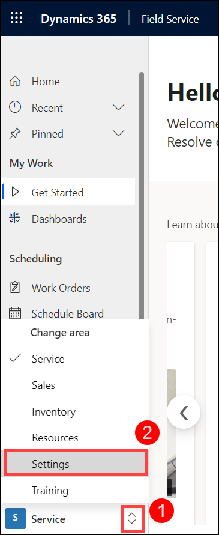
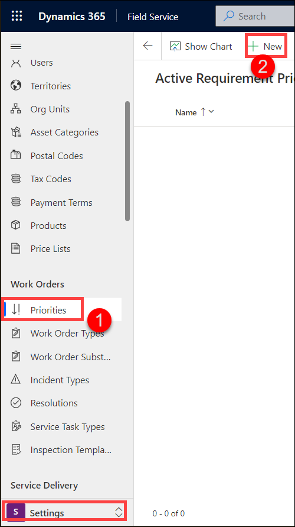
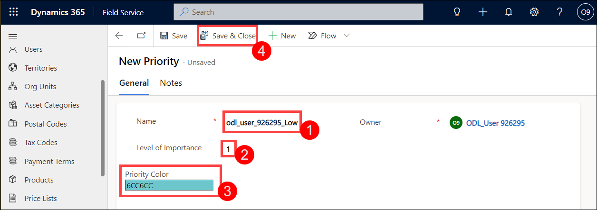
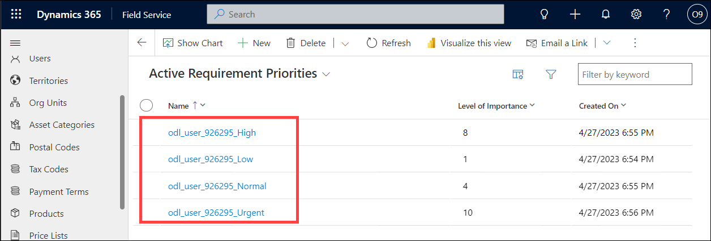
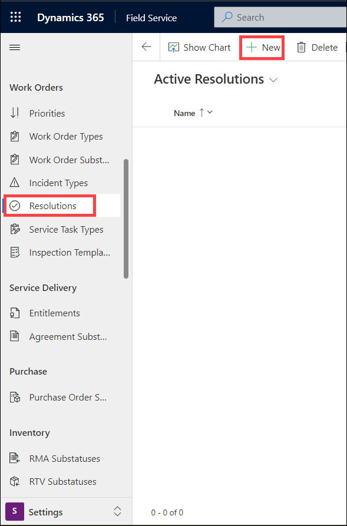
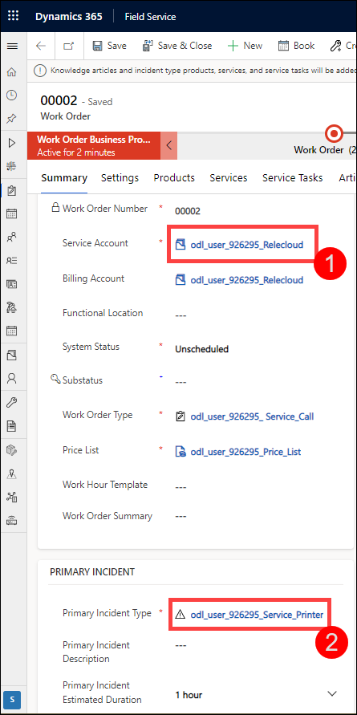
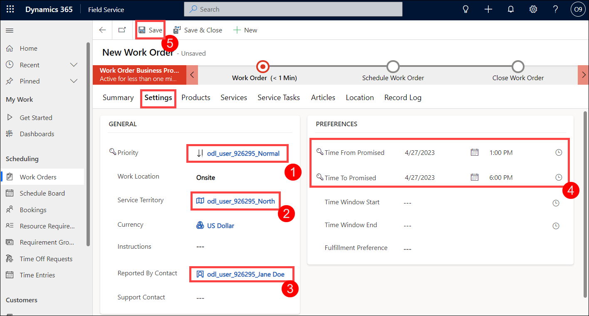
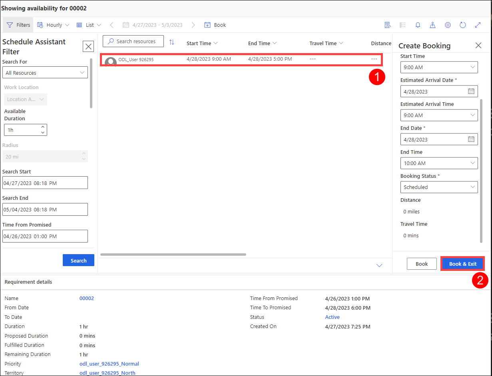

# Practice Lab 5 - Work order management

## Exercise 1 – Settings for work orders

In this exercise, you will configure settings for work orders including priorities and resolutions.

### Task 1 - Priorities

1. In the **Dynamics 365 Field Service app**, click the **Service (1)** area in the bottom-left of the sitemap, and select **Settings (2)** from the list. 

    

1. In the **Work Orders** group select **Priorities(1)**.

1. Click **+ New (2)**.

    

1. Enter **Low** for **Name (1)**.

1. Select **1** from the **Level of Importance (2)** drop-down field.

1. Enter **6CC6CC** for **Priority Color (3)**.

1. Click **Save & Close (4)**.

    

1. Click **+ New**.

1. Enter **Normal** for **Name**.

1. Select **4** from the **Level of Importance** drop-down field.

1. Enter **FFA8FC** for **Priority Color**.

1. Click **Save & Close**.

1. Click **+ New**.

1. Enter **High** for **Name**.

1. Select **8** from the **Level of Importance** drop-down field.

1. Enter **FF8E42** for **Priority Color**.

1. Click **Save & Close**

1. Click **+ New**.

1. Enter **Urgent** for **Name**.

1. Select **10** from the **Level of Importance** drop-down field.

1. Enter **FF1C33** for **Priority Color**.

1. Click **Save & Close**. You should have a total of 4 priorities created as shown below.

    

### Task 2 - Resolutions

1. In the **Work Orders** group select **Resolutions**.

1. Click **+ New**.

    

1. Enter **Replaced Toner** for **Name (1)**.

1. Click **Save & Close (2)**

    

1. Click **+ New**.

1. Enter **Replaced Printer Drum** for **Name**.

1. Click **Save & Close**

1. Click **+ New**.

1. Enter **Inspection complete no issues** for **Name**.

1. Click **Save & Close**

1. Click **+ New**.

1. Enter **Inspection complete with issues** for **Name**.

1. Click **Save & Close**. You should have a total of 4 active resolutions created as shown below.

    

## Exercise 2 – Create and process work orders

In this exercise, you will create work orders, schedule the work orders, and complete the work orders.

### Task 1 - Create a new work order using an incident type

1. In the **Dynamics 365 Field Service app**, click the **Service**.

    

1. In the **Scheduling** group select **Work Orders (1)**.

1. Click **+ New (2)**.

    

1. Select the **Relecloud** account you created in a previous lab for **Service Account (1)**.

1. Select the **Service Printer** incident type you created in a previous lab for **Primary Incident Type (2)**.

    

1. Select the **Settings** tab.

1. Select the **Normal** priority you created in Exercise 1 for **Priority (2)**.

1. Select the **North** territory you created in a previous lab **Service Territory (2)**.

1. Select the **Jane Doe** contact you created in a previous lab for **Reported By Contact (3)**.

1. Enter **Yesterday \@ 1:00 PM** for **Time from Promised (4)**.

1. Enter **Tomorrow \@ 6:00 PM** for **Time to Promised (4)**.

1. Click **Save (5)**.

    

### Task 2 - Schedule the work order using the schedule assistant

Field Service provides several items that can be used to assist in scheduling resources for specific items. The two primary components that are used are the Schedule Board and the Schedule Assistant. The Schedule Board provides the ability to manually schedule items, and the assistant offers suggestions on resources based on factors like location, skills, and availability. In this task we will examine how you can use the Book button from within the work order.

1. In the work order you created in Task 1, click on the **Book** button in the command bar.

    

1. In the new window that opens up, select the **ODL user DID (1)** entry that shows up and select a time slot and click **Book & Exit (2)**.

    

### Task 3 - Create an incident type from a work order

1. Edit the work order you completed in the previous task.

1. Click **Create Incident Type** in the command bar.

    

1. Enter **Quick Inspection** for **Name (1)**.

1. Click **Create Incident Type (2)**.

    

1. Click **Yes** to the prompt, and inspect the new incident type.

    

    
