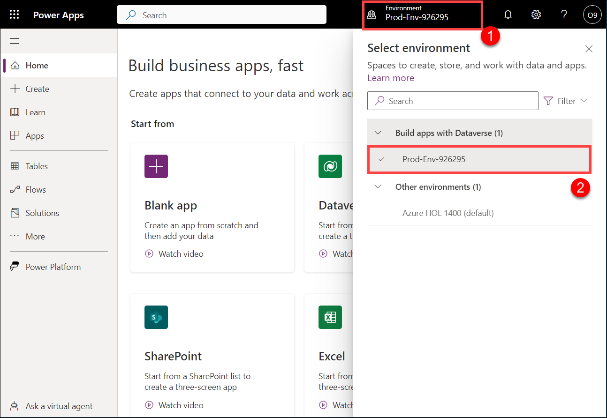

# Practice Lab 13 – Customize Schedule Boards

## Scenario

Dispatchers have requested more information about the customer and work order to be displayed on the schedule board. You are going to customize the views used by the schedule board to achieve this.

   >Note: The **[DeploymentId]/[DID] can be found under the environment details tab in the user name (example: `odl_user_xxxxxx.onmicrosoft.com`) **xxxxxx** is the [DeploymentID]**.

## Exercise 1: Gather components to customizes

In this exercise, you will create a solution and add the views used on the schedule board

### Task 1: Create solution

1. Navigate to the Power Apps Maker portal <https://make.powerapps.com>

1. Select the **Prod-Env-926295** environment.
    
    

1. Click **Solutions**.

1. Click **+ New solution**.

1. Enter **odl_user_926295_Solution** for **Name**.

1. Click **+ New publisher**.

1. Enter **odl_user_926295** for **Display Name**.

1. Enter **odl_user_926295** for **Name**.

1. Enter **odl_user_926295** for **Prefix**.

1. Click **Save**.

1. Select the **odl_user_926295** publisher.

1. Click **Create**.

### Task 2: Add views to solution

1. Click on **odl_user_926295_Solution**.

1. Click **Add existing** and select **Table**.

1. Select **Bookable Resource Booking** and click **Next**

1. Click **Select objects**.

1. Select the **Views** tab.

1. Select **Schedule Board Details Pane Field Layout**.

1. Select **Work Order Booking Map Tooltips view**.

1. Click **Add**.

1. Click **Add**.

1. Click **Add existing** and select **Table**.

1. Select **Resource Requirement** and click **Next**

1. Click **Select objects**.

1. Select the **Views** tab.

1. Select **Active Resource Requirements**.

1. Select **Unscheduled Work Order Requirements**.

1. Click **Add**.

1. Click **Add**.

1. Click **Add existing** and select **Table**.

1. Select **Bookable Resource** and click **Next**.

1. Click **Select objects**.

1. Select the **Views** tab.

1. Select **Active Bookable Resources**.

1. Click **Add**.

1. Click **Add**.

### Task 3: Customize views

1. Edit your **odl_user_926295_Solution**.

1. Select **Bookable Resource** table.

1. Edit the **Active Bookable Resources** view.

1. Add the **Start Location** column to the view.

1. Add the **Organizational Unit** column to the view.

1. Add the **Hourly Rate** column to the view.

1. Click **Save As**.

1. Enter **odl_user_926295_Bookable_Resource_Detail_panel** for **Name** and click **Save**.

1. Click **Publish**.

1. Click **Back**.

1. Select **Bookable Resource Booking** table.

1. Select the **Views** tab.

1. Click **+ New view**.

1. Enter **odl_user_926295_BRB_Details_panel** for **Name** and click **Create**.

1. Add the **Work Order** column to the view.

1. Add the **Booking Status** column to the view.

1. Add the **Duration** column to the view.

1. Add the **Resource** column to the view.

1. Select the **Related** tab and expand **Work Order**.

1. Add the **Work Order Type** column to the view.

1. Add the **Primary Incident Customer Asset** column to the view.

1. Click **Save**.

1. Click **Publish**.

1. Click **Back**.

1. Select **Bookable Resource Booking** table.

1. Select the **Views** tab.

1. Click **+ New view**.

1. Enter **odl_user_926295_BRB_Tooltip** for **Name** and click **Create**.

1. Add the **Work Order** column to the view.

1. Remove the **Name** column.

1. Add the **Resource** column to the view.

1. Add the **Booking Status** column to the view.

1. Select the **Related** tab and expand **Work Order**.

1. Add the **Work Order Type** column to the view.

1. Add the **Service Account** column to the view.

1. Add the **Functional Location** column to the view.

1. Add the **Primary Incident Customer Asset** column to the view.

1. Click **Save**.

1. Click **Publish**.

1. Click **Back**.

1. Select **Resource Requirement** table.

1. Select the **Views** tab.

1. Click **+ New view**.

1. Enter **odl_user_926295_Unscheduled_North_Territory_Work Orders** for **Name** and click **Create**.

1. Add the **Work Order** column to the view.

1. Remove the **Name** column.

1. Add the **Duration** column to the view.

1. Add the **Priority** column to the view.

1. Select the **Related** tab and expand **Work Order**.

1. Add the **Work Order Type** column to the view.

1. Add the **Service Account** column to the view.

1. Add the **Functional Location** column to the view.

1. Add the **Primary Incident Customer Asset** column to the view.

1. Select **Priority** for **Sort By**.

1. Click the arrow to sort descending.

1. Click **Edit filters**.

1. Click **+ Add** and select **Add row**.

1. Select **Remaining Duration** with operator **Is greater than** and value **0 minutes**.

1. Click **+ Add** and select **Add related table**.

1. Select **Work Order**.

1. Select **Service Territory** with operator **Equals** and value **odl_user_926295_North**.

1. Click **Ok**.

1. Click **Save**.

1. Click **Publish**.

1. Click **Back**.

### Task 4: Use views on schedule board

1. In the **Dynamics 365 Field Service app**, click the **Service** area in the bottom-left of the sitemap, and in the **Scheduling** group select **Schedule Board**.

1. Select the  **odl_user_926295_Board** tab.

1. Click the ellipsis (...) next to the name of the tab and select **Board settings**.

1. Select the **Map** tab.

1. Select **odl_user_926295_Bookable_Resource_Detail_panel** for **Resource details view**.

1. Expand **Schedule types** and select **Other**.

1. Select **odl_user_926295_BRB_Details_panel** for **Booking details view**.

1. Expand **Schedule types** and select **Work Order**.

1. Select **odl_user_926295_BRB_Tooltip** for **Booking tooltips view**.

1. Select **odl_user_926295_BRB_Details_panel** for **Booking details view**.

1. Select **Requirement panels**.

1. Toggle **Show default requirement panels** to **Off**.

1. Click on **+**.

1. Enter **North work orders to schedule** for **Title**.

1. Select **odl_user_926295_Unscheduled_North_Territory Work Orders** for **View**.

1. Click **Save**.

### Task 5: Test the changes

1. Verify that the requirements panel only shows the view you created.

1. Select the a booking and verify the tooltip reflects the changes you made.

1. Click on the **Detail panel** icon.

1. Click on the resource cell and verify the details pane reflects the changes you made.
