# Practice Lab 13 – Customize Schedule Boards

## Scenario

Dispatchers have requested more information about the customer and the work order to be displayed on the schedule board. You are going to customize the views used by the schedule board to achieve this.

## Exercise 1: Gather components to customizes

In this exercise, you will create a solution and add the views used on the schedule board

### Task 1: Create solution.

1. Navigate to the Power Apps Maker portal <https://make.powerapps.com>

1. Select the **Prod-Env** environment.

1. Click **Solutions (1)**.

1. Click **+ New solution (2)**.

1. Enter **Solution** for **Display Name & Name (3)**.

1. Click **+ New publisher (4)**.

    

1. Enter **odl_user_DID** for **Display Name (1)**.

1. Enter **odl_user_DID** for **Name (2)**.

1. Enter **powerapp** for **Prefix (3)**.

1. Click **Save (4)**.

    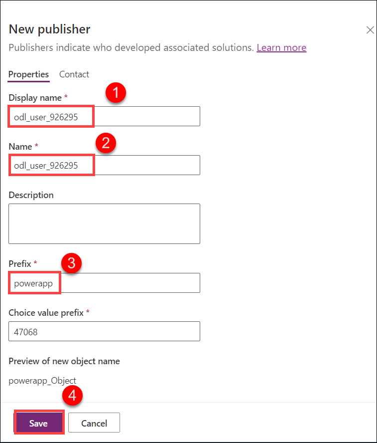

1. Select the **odl_user_DID** publisher.

1. Click **Create**.

    

### Task 2: Add views to solution

1. In Power Apps, Click on **Solution**.

    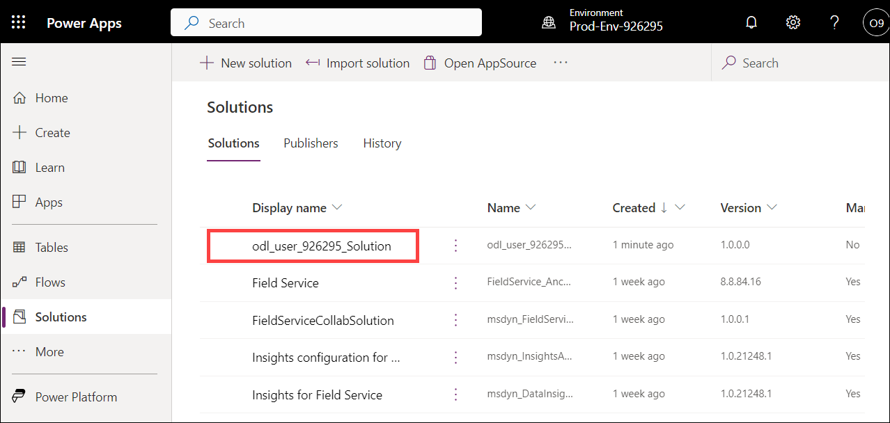

1. Click **Add existing (1)** and select **Table (2)**.

    

1. Select **Bookable Resource Booking** and click **Next**

    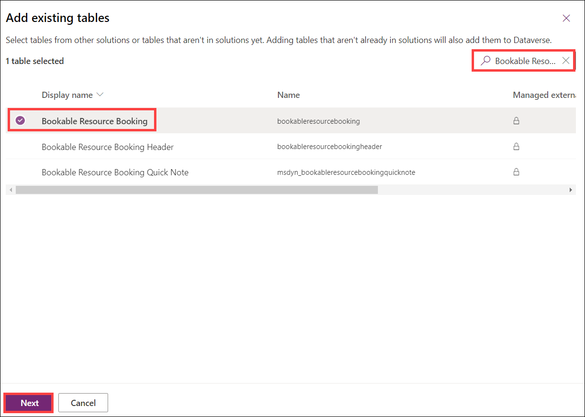

1. Click **Select objects**.

    

1. Select the **Views** tab.

1. Select **Schedule Board Details Pane Field Layout**.

1. Select **Work Order Booking Map Tooltips view**.

    

1. Click **Add**.

1. Click **Add**.

1. Click **Add existing (1)** and select **Table (2)**.

    

1. Select **Resource Requirement** and click **Next**

1. Click **Select objects**.

1. Select the **Views** tab.

1. Select **Active Resource Requirements**.

1. Select **Unscheduled Work Order Requirements**.

    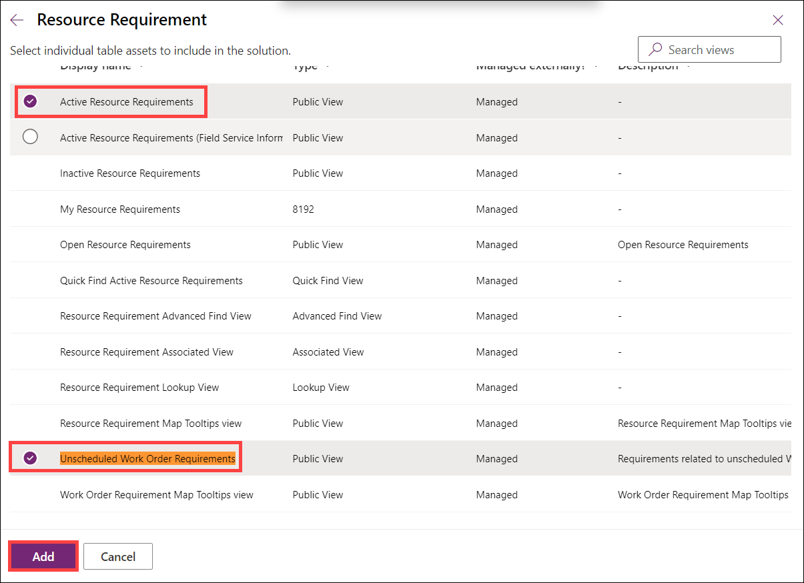

1. Click **Add**.

1. Click **Add**.

1. Click **Add existing** and select **Table**.

1. Select **Bookable Resource** and click **Next**.

1. Click **Select objects**.

1. Select the **Views** tab.

1. Select **Active Bookable Resources**.

1. Click **Add**.

1. Click **Add**.

1. There should be three resources of the type table as shown below.

    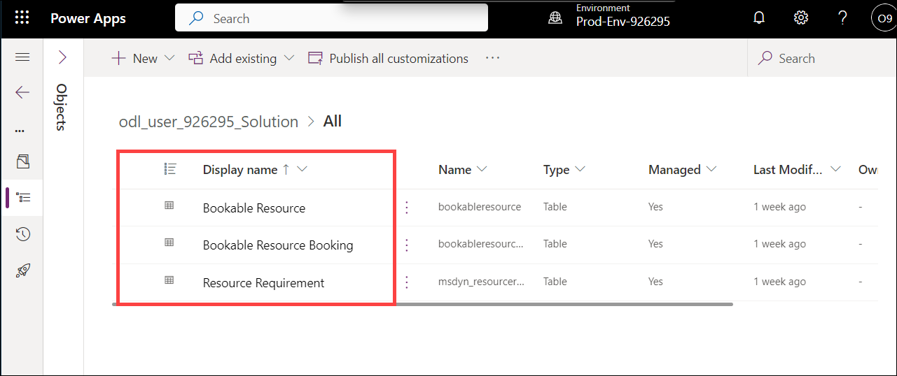

### Task 3: Customize views

1. Edit your **Solution**.

1. Select **Bookable Resource** table.

    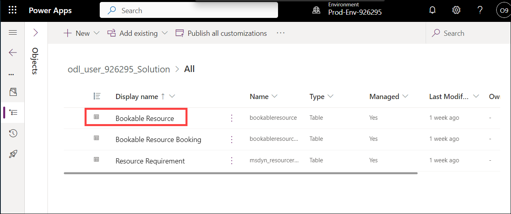

1. Edit the **Active Bookable Resources** view.

    

1. Search for **Start Location** column in the searchbox and select the **Start Location** resource that shows up.

    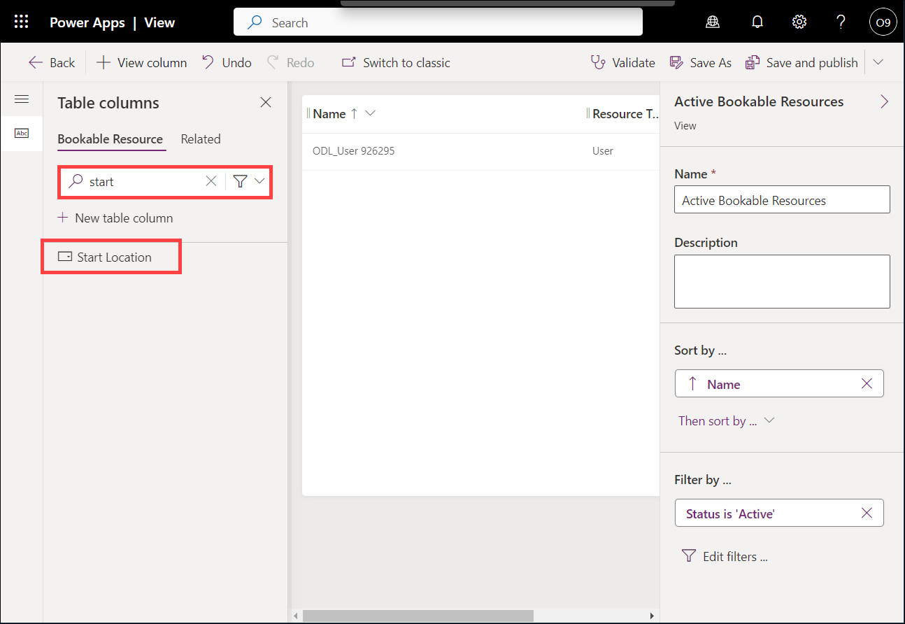

1. Add the **Organizational Unit** column to the view.

1. Add the **Hourly Rate** column to the view.

1. Click **Save As (1)**.

1. Enter **Bookable Resource Detail panel** for **Name (2)** and click **Save (3)**.

    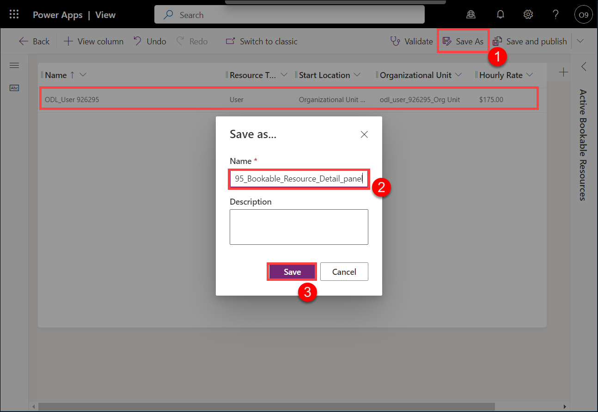

1. Click **Save and Publish**.

1. Click **Back**.

1. Select **Bookable Resource Booking (1)** table.

1. Select the **Views (2)** tab.

    

1. Click **+ New view**.

1. Enter **BRB Details panel** for **Name** and click **Create**.

    

1. Add the **Work Order** column to the view.

    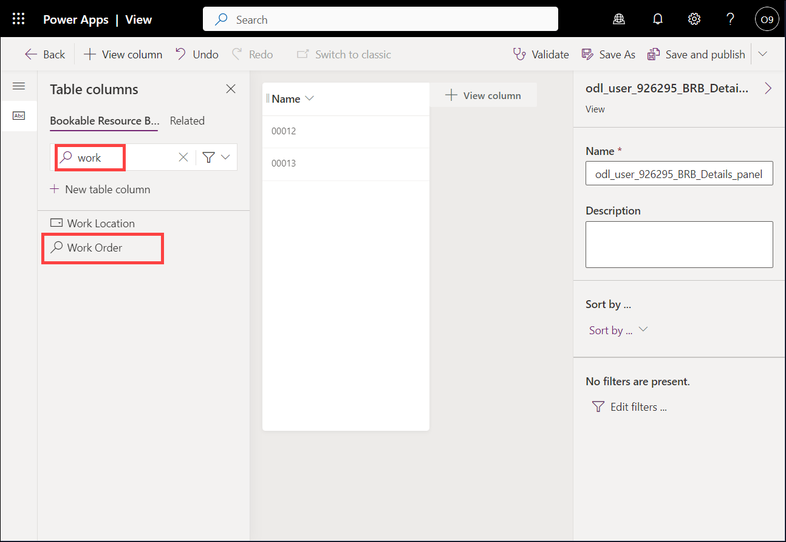

1. Add the **Booking Status** column to the view.

1. Add the **Duration** column to the view.

1. Add the **Resource** column to the view.

1. Select the **Related** tab and expand **Work Order**.

    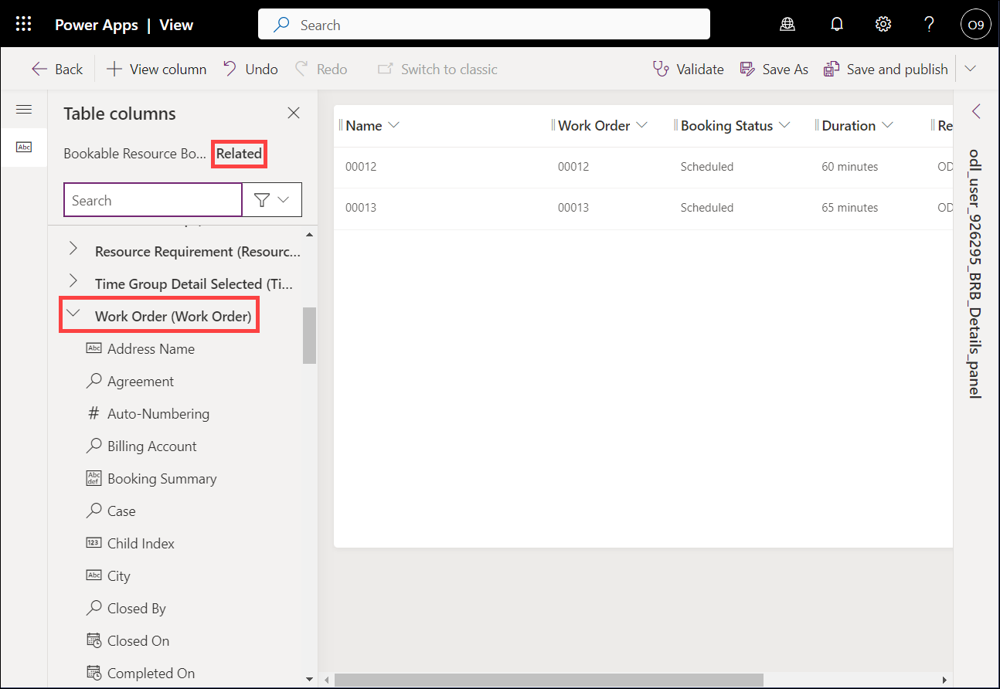

1. Add the **Work Order Type** column to the view.

1. Add the **Primary Incident Customer Asset** column to the view.

    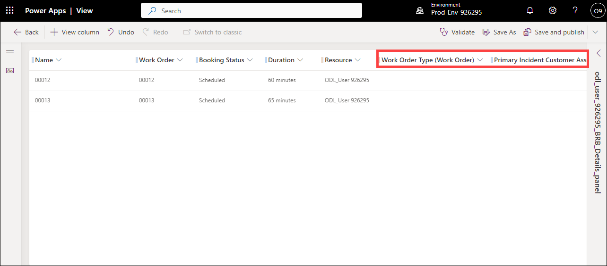

1. Click **Save and Publish**.

1. Click **Back**.

1. Select **Bookable Resource Booking (1)** table.

1. Select the **Views (2)** tab.

    

1. Click **+ New view**.

1. Enter **BRB Tooltip** for **Name** and click **Create**.

    

1. Add the **Work Order** column to the view.

1. Add the **Resource** column to the view.

1. Add the **Booking Status** column to the view.

1. Remove the **Name** column.

    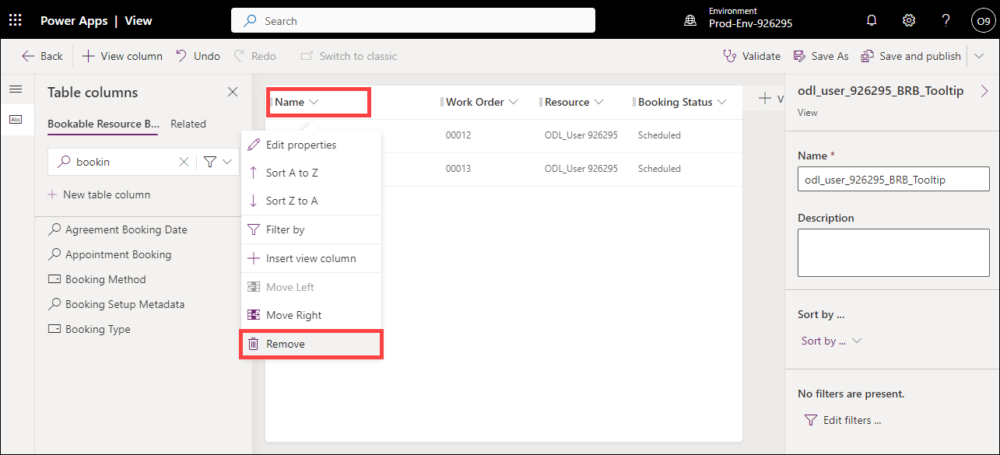

1. Select the **Related** tab and expand **Work Order**.

1. Add the **Work Order Type** column to the view.

1. Add the **Service Account** column to the view.

1. Add the **Functional Location** column to the view.

1. Add the **Primary Incident Customer Asset** column to the view.

1. Click **Save and Publish**.

1. Click **Back**.

1. Select **Resource Requirement** table.

1. Select the **Views** tab.

    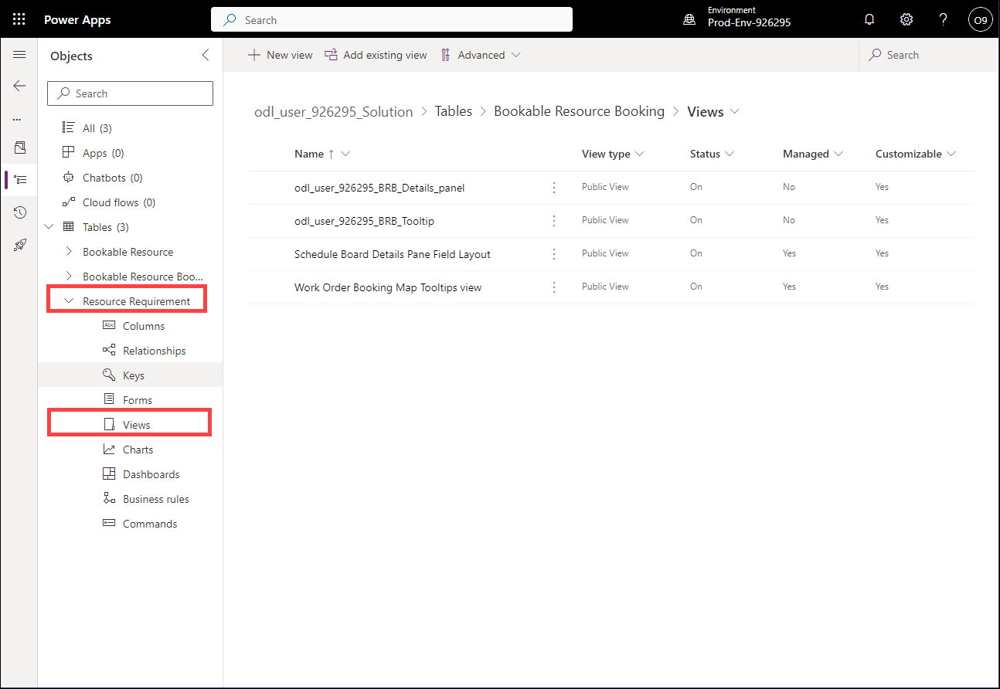

1. Click **+ New view**.

1. Enter **Unscheduled North Territory Work Orders** for **Name** and click **Create**.

    

1. Add the **Work Order** column to the view.

1. Add the **Duration** column to the view.

1. Add the **Priority** column to the view.

1. Remove the **Name** column.

1. Select the **Related** tab and expand **Work Order**.

1. Add the **Work Order Type** column to the view.

1. Add the **Service Account** column to the view.

1. Add the **Functional Location** column to the view.

1. Add the **Primary Incident Customer Asset** column to the view.

1. Select **Priority** for **Sort By**.

    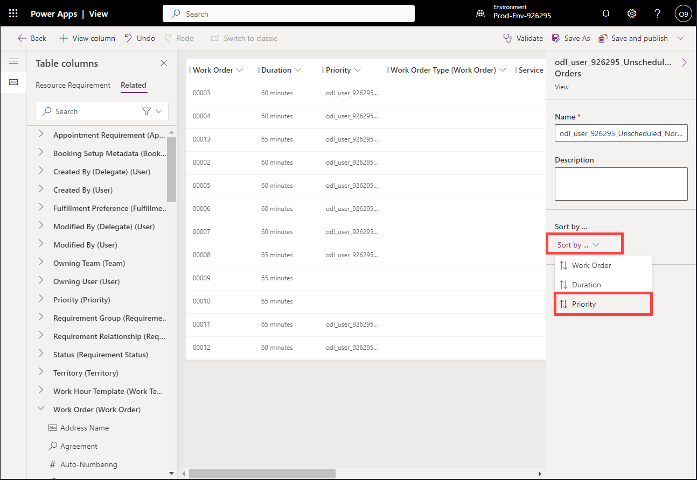

1. Click the arrow to sort descending (1).

1. Click **Edit filters (2)**.

    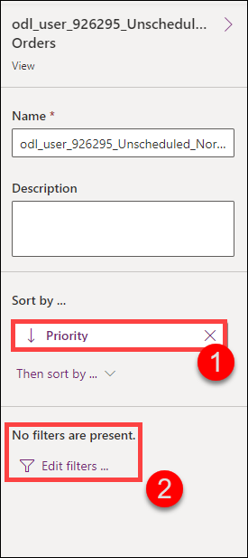

1. Click **+ Add** and select **Add row**.

    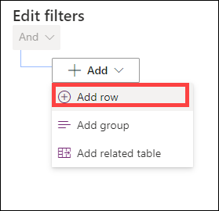

1. Select **Remaining Duration** with operator **Is greater than** and value **0 minutes**.

1. Click **+ Add** and select **Add related table**.

1. Select **Work Order**.

1. Select **Service Territory** with operator **Equals** and value **North**.

1. Click **Ok**.

    

1. Click **Save and Publish**.

1. Click **Back**.

### Task 4: Use views on schedule board

1. Navigate back to the **Dynamics 365 Field Service app**.

1. In the **Dynamics 365 Field Service app**, click the **Resources (1)** area in the bottom-left of the sitemap, and select **Service (2)** from the list. 

    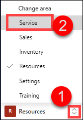
    
1. In the **Scheduling** group select **Schedule Board**.

1. Select the  **Board** tab.

1. Click the ellipsis (...) next to the name of the tab and select **Board settings**.

    

1. Select the **Map** tab.

1. Select **Bookable Resource Detail panel** for **Resource details view**.

    

1. Expand **Schedule types** and select **Appointments**.

1. Select **BRB Details panel** for **Booking details view**.

    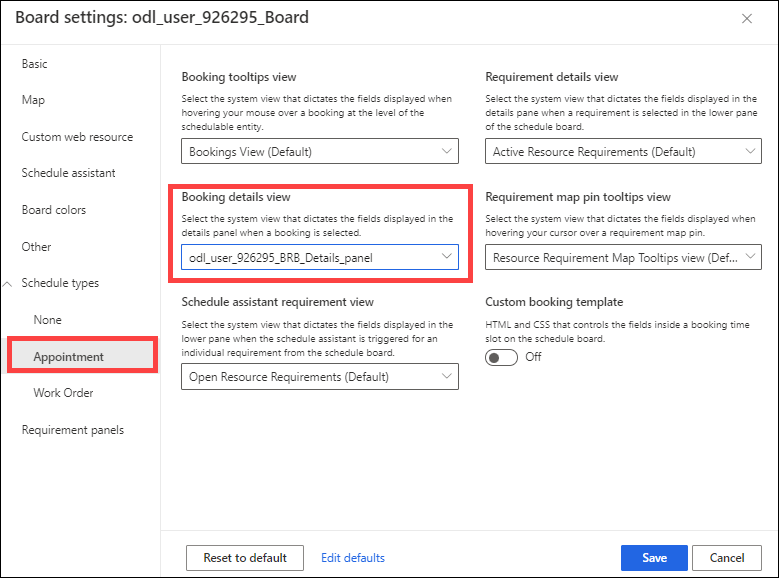

1. Expand **Schedule types** and select **Work Order**.

1. Select **BRB Tooltip** for **Booking tooltips view**.

1. Select **BRB Details panel** for **Booking details view**.

    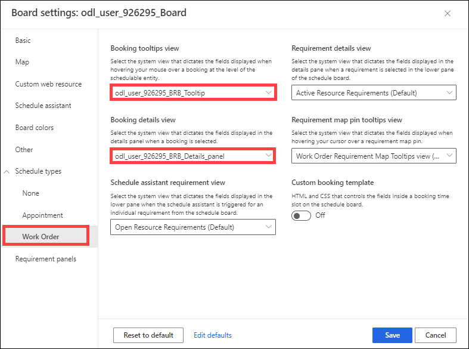

1. Select **Requirement panels (1)**.

1. Toggle **Show default requirement panels (2)** to **Off**.

1. Click on **+**.

1. Enter **North work orders to schedule** for **Title (4)**.

1. Select **Unscheduled North Territory Work Orders** for **View (5)**.

1. Click **Save (6)**.

    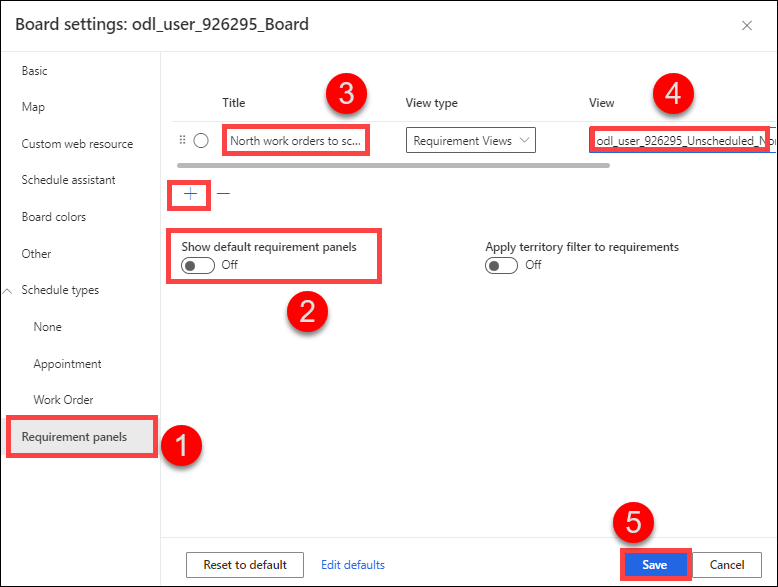

> **Congratulations** on completing the task! Now, it's time to validate it. Here are the steps:
> - Select the **Lab Validation** tab located at the upper right corner of the lab guide section.
> - Hit the Validate button for the corresponding task. If you receive a success message, you can proceed to the next task. 
> - If not, carefully read the error message and retry the step, following the instructions in the lab guide.
> - If you need any assistance, please contact us at labs-support@spektrasystems.com. We are available 24/7 to help you out.

### Task 5: Test the changes

1. In the **Dynamics 365 Field Service app**, Verify that the requirements panel only shows the view you created.

    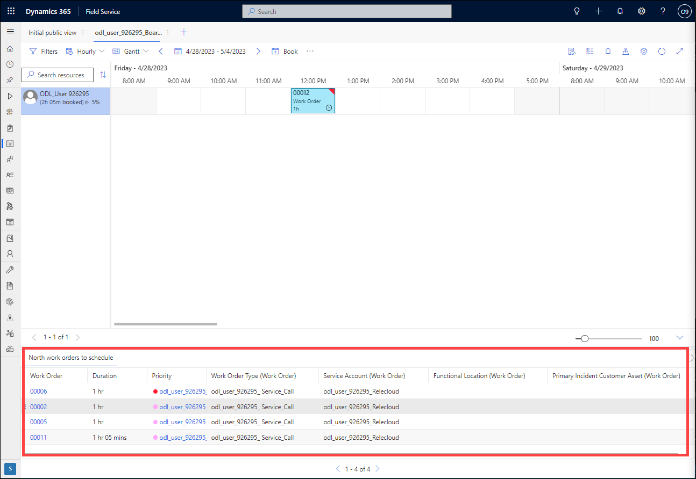

1. Select the booking and verify the tooltip reflects the changes you made.

    

1. Click on the **Detail panel** icon.

1. Click on the resource cell and verify the details pane reflects the changes you made.

    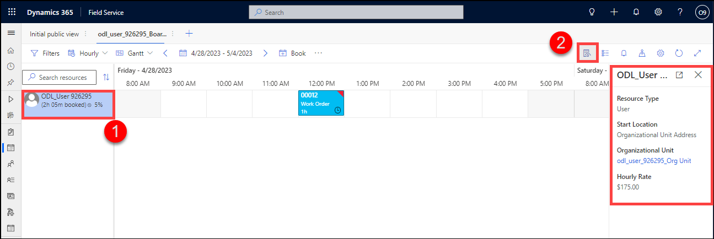

**Result:** You have successfully created, added views to the solution, customized views to the solution in Power Apps Portal. Then you have used the views on scheduled borads and tested successfully.
